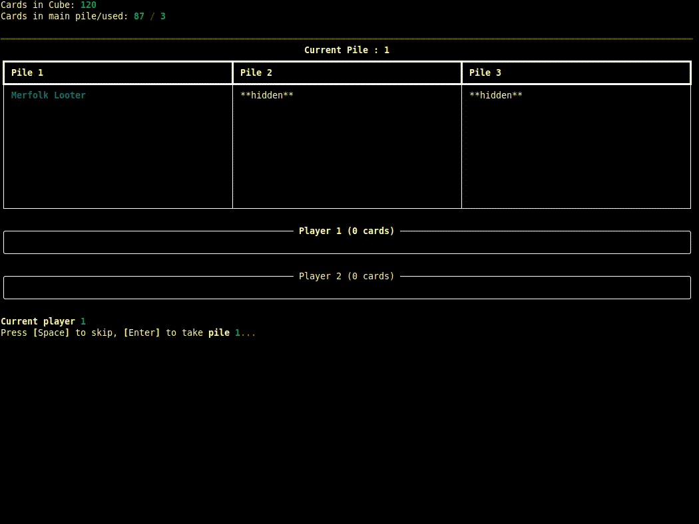

# Winston Cube Sim


Little python command line app to simulate a [Winston Draft], a two-player draft format for Magic: The Gathering. This 
will take a list of cards exported from [CubeCobra] and allow you to test a [cube] for this format (as it isn't available
on CubeCobra).



## Installation

The code can be pulled in from GitHub, and set up a virtual environment with the required package as shown below.

```bash
git clone https://github.com/4dcu-be/WinstonCubeSim
cd WinstonCubeSim
python -m venv venv
source venv/bin/activate
pip install -r requirements
```

## Starting the app

Simply start with the command below, it takes exactly one argument, a path to a CVS file from CubeCobra with the
list of in the cube.

```bash
python main.py ./data/PremodernSultaiWinston_v2.csv
```

Windows users can also use the binary executable, which can be found in the releases.


## The controls

You will see in bold the current pile and have the option to take (by pressing ENTER) or skip (pressing SPACE) that 
pile. If you skip on the third pile the top card of the library is taken. Next, the AI player will execute their turn,
this simply picks a random pile though piles with more cards have a higher chance of being picked. 

Once the cube is empty, all cards picked by the human and AI player are shown along with the cards that weren't used
in the draft (in case your cube exceeds the required number of cards or Winston draft (90 cards))


[Winston Draft]: https://mtg.fandom.com/wiki/Winston_Draft
[cube]: https://mtg.fandom.com/wiki/Cube_Draft#:~:text=Cube%20Draft%20is%20a%20casual,of%20playing%20a%20limited%20game.
[CubeCobra]: https://cubecobra.com/